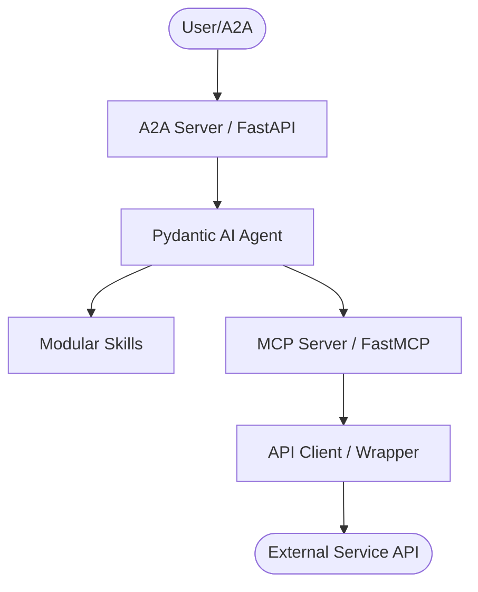
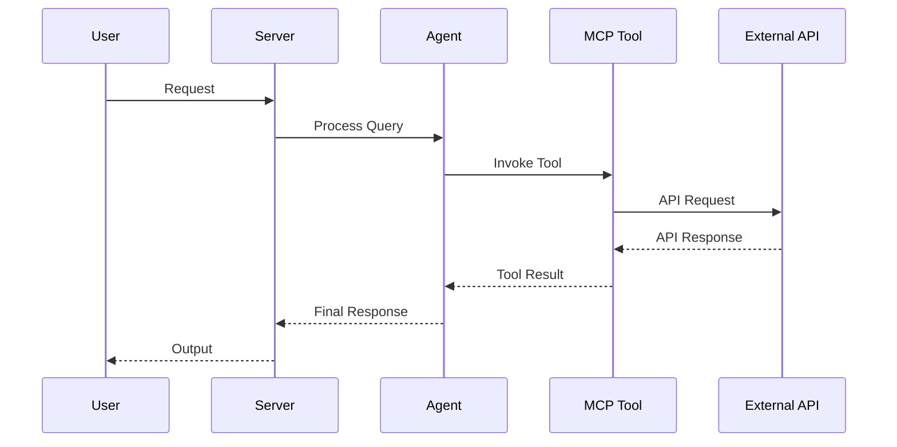
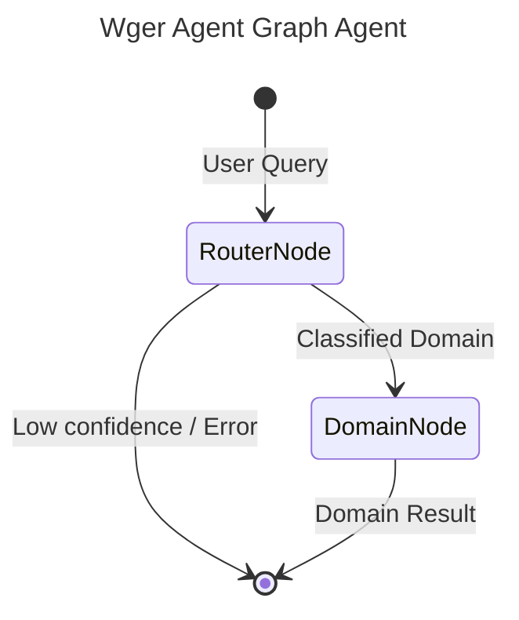

# AGENTS.md

## Tech Stack & Architecture
- Language/Version: Python 3.10+
- Core Libraries: `agent-utilities`, `fastmcp`, `pydantic-ai`
- Key principles: Functional patterns, Pydantic for data validation, asynchronous tool execution.
- Architecture:
    - `mcp_server.py`: Main MCP server entry point and tool registration.
    - `agent.py`: Pydantic AI agent definition and logic.
    - `skills/`: Directory containing modular agent skills (if applicable).
    - `agent/`: Internal agent logic and prompt templates.

### Architecture Diagram


### Workflow Diagram


## Commands (run these exactly)
# Installation
pip install .[all]

# Quality & Linting (run from project root)
pre-commit run --all-files

# Execution Commands
# wger-mcp\nwger_agent.mcp:mcp_server\n# wger-agent\nwger_agent.agent:agent_server

## Project Structure Quick Reference
- MCP Entry Point → `mcp_server.py`
- Agent Entry Point → `agent.py`
- Source Code → `wger_agent/`
- Skills → `skills/` (if exists)

### File Tree
```text
├── .bumpversion.cfg\n├── .dockerignore\n├── .env\n├── .gitattributes\n├── .gitignore\n├── .pre-commit-config.yaml\n├── AGENTS.md\n├── Dockerfile\n├── LICENSE\n├── MANIFEST.in\n├── README.md\n├── compose.yml\n├── debug.Dockerfile\n├── pyproject.toml\n├── requirements.txt\n├── wger_agent\n│   ├── __init__.py\n│   ├── agent\n│   │   ├── AGENTS.md\n│   │   ├── CRON.md\n│   │   ├── CRON_LOG.md\n│   │   ├── HEARTBEAT.md\n│   │   ├── IDENTITY.md\n│   │   ├── MEMORY.md\n│   │   ├── USER.md\n│   │   └── mcp_config.json\n│   ├── agent.py\n│   ├── auth.py\n│   ├── mcp_server.py\n│   ├── skills\n│   │   └── wger-agent-docs\n│   └── api_wrapper.py\n└── wger_agent.egg-info\n    ├── PKG-INFO\n    ├── SOURCES.txt\n    ├── dependency_links.txt\n    ├── entry_points.txt\n    ├── requires.txt\n    └── top_level.txt
```

## Code Style & Conventions
**Always:**
- Use `agent-utilities` for common patterns (e.g., `create_mcp_server`, `create_agent`).
- Define input/output models using Pydantic.
- Include descriptive docstrings for all tools (they are used as tool descriptions for LLMs).
- Check for optional dependencies using `try/except ImportError`.

**Good example:**
```python
from agent_utilities import create_mcp_server
from mcp.server.fastmcp import FastMCP

mcp = create_mcp_server("my-agent")

@mcp.tool()
async def my_tool(param: str) -> str:
    """Description for LLM."""
    return f"Result: {param}"
```

## Dos and Don'ts
**Do:**
- Run `pre-commit` before pushing changes.
- Use existing patterns from `agent-utilities`.
- Keep tools focused and idempotent where possible.

**Don't:**
- Use `cd` commands in scripts; use absolute paths or relative to project root.
- Add new dependencies to `dependencies` in `pyproject.toml` without checking `optional-dependencies` first.
- Hardcode secrets; use environment variables or `.env` files.

## Safety & Boundaries
**Always do:**
- Run lint/test via `pre-commit`.
- Use `agent-utilities` base classes.

**Ask first:**
- Major refactors of `mcp_server.py` or `agent.py`.
- Deleting or renaming public tool functions.

**Never do:**
- Commit `.env` files or secrets.
- Modify `agent-utilities` or `universal-skills` files from within this package.

## When Stuck
- Propose a plan first before making large changes.
- Check `agent-utilities` documentation for existing helpers.


## Graph Architecture

This agent uses `pydantic-graph` orchestration for intelligent routing and optimal context management.



- **RouterNode**: A fast, lightweight LLM (e.g., `nvidia/nemotron-3-super`) that classifies the user's query into one of the specialized domains.
- **DomainNode**: The executor node. For the selected domain, it dynamically sets environment variables to temporarily enable ONLY the tools relevant to that domain, creating a highly focused sub-agent (e.g., `gpt-4o`) to complete the request. This preserves LLM context and prevents tool hallucination.


## Testing with Timeout

To run tests with a timeout to prevent hanging, use the `pytest-timeout` plugin. You can combine it with the `-k` flag to run specific tests:

```bash
uv run pytest --timeout=60 -k "test_name_pattern"
```
