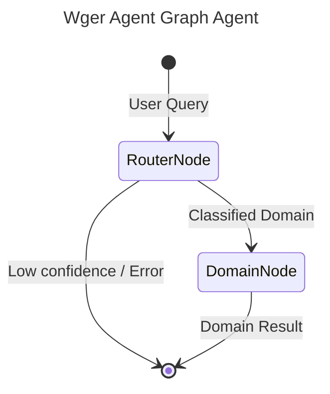

# Wger - A2A | AG-UI | MCP


*Version: 0.11.0*

## Overview

**Wger MCP Server + A2A Agent**

Wger Workout Manager — exercise database, workout routines, nutrition plans, body measurements, and progress tracking.

This repository is actively maintained - Contributions are welcome!

## MCP

### Using as an MCP Server

The MCP Server can be run in two modes: `stdio` (for local testing) or `http` (for networked access).

#### Environment Variables

*   `WGER_INSTANCE`: The URL of the target service.
*   `WGER_ACCESS_TOKEN`: The API token or access token.

#### Run in stdio mode (default):
```bash
export WGER_INSTANCE="http://localhost:8080"
export WGER_ACCESS_TOKEN="your_token"
wger-mcp --transport "stdio"
```

#### Run in HTTP mode:
```bash
export WGER_INSTANCE="http://localhost:8080"
export WGER_ACCESS_TOKEN="your_token"
wger-mcp --transport "http" --host "0.0.0.0" --port "8000"
```

## A2A Agent

### Run A2A Server
```bash
export WGER_INSTANCE="http://localhost:8080"
export WGER_ACCESS_TOKEN="your_token"
wger-agent --provider openai --model-id gpt-4o --api-key sk-...
```

## Docker

### Build

```bash
docker build -t wger-agent .
```

### Run MCP Server

```bash
docker run -d \
  --name wger-agent \
  -p 8000:8000 \
  -e TRANSPORT=http \
  -e WGER_INSTANCE="http://your-service:8080" \
  -e WGER_ACCESS_TOKEN="your_token" \
  knucklessg1/wger-agent:latest
```

### Deploy with Docker Compose

```yaml
services:
  wger-agent:
    image: knucklessg1/wger-agent:latest
    environment:
      - HOST=0.0.0.0
      - PORT=8000
      - TRANSPORT=http
      - WGER_INSTANCE=http://your-service:8080
      - WGER_ACCESS_TOKEN=your_token
    ports:
      - 8000:8000
```

#### Configure `mcp.json` for AI Integration (e.g. Claude Desktop)

```json
{
  "mcpServers": {
    "wger": {
      "command": "uv",
      "args": [
        "run",
        "--with",
        "wger-agent",
        "wger-mcp"
      ],
      "env": {
        "WGER_INSTANCE": "http://your-service:8080",
        "WGER_ACCESS_TOKEN": "your_token"
      }
    }
  }
}
```

## Install Python Package

```bash
python -m pip install wger-agent
```
```bash
uv pip install wger-agent
```

## Repository Owners


## Graph Architecture

This agent uses `pydantic-graph` orchestration for intelligent routing and optimal context management.



- **RouterNode**: A fast, lightweight LLM (e.g., `nvidia/nemotron-3-super`) that classifies the user's query into one of the specialized domains.
- **DomainNode**: The executor node. For the selected domain, it dynamically sets environment variables to temporarily enable ONLY the tools relevant to that domain, creating a highly focused sub-agent (e.g., `gpt-4o`) to complete the request. This preserves LLM context and prevents tool hallucination.


## MCP Configuration Examples

### 1. Standard IO (stdio) Deployment

```json
{
  "mcpServers": {
    "wger-agent": {
      "command": "uv",
      "args": [
        "run",
        "wger-mcp"
      ],
      "env": {
        "AGENT_DESCRIPTION": "<YOUR_AGENT_DESCRIPTION>",
        "AGENT_SYSTEM_PROMPT": "<YOUR_AGENT_SYSTEM_PROMPT>",
        "BODYTOOL": "True",
        "DEFAULT_AGENT_NAME": "<YOUR_DEFAULT_AGENT_NAME>",
        "EXERCISETOOL": "True",
        "NUTRITIONTOOL": "True",
        "ROUTINECONFIGTOOL": "True",
        "ROUTINETOOL": "True",
        "USERTOOL": "True",
        "WGER_ACCESS_TOKEN": "<YOUR_WGER_ACCESS_TOKEN>",
        "WGER_INSTANCE": "<YOUR_WGER_INSTANCE>",
        "WGER_VERIFY": "<YOUR_WGER_VERIFY>",
        "WORKOUTTOOL": "True"
      }
    }
  }
}
```

### 2. Streamable HTTP (SSE) Deployment

```json
{
  "mcpServers": {
    "wger-agent": {
      "command": "uv",
      "args": [
        "run",
        "wger-mcp",
        "--transport",
        "http",
        "--host",
        "0.0.0.0",
        "--port",
        "8000"
      ],
      "env": {
        "AGENT_DESCRIPTION": "<YOUR_AGENT_DESCRIPTION>",
        "AGENT_SYSTEM_PROMPT": "<YOUR_AGENT_SYSTEM_PROMPT>",
        "BODYTOOL": "True",
        "DEFAULT_AGENT_NAME": "<YOUR_DEFAULT_AGENT_NAME>",
        "EXERCISETOOL": "True",
        "NUTRITIONTOOL": "True",
        "ROUTINECONFIGTOOL": "True",
        "ROUTINETOOL": "True",
        "USERTOOL": "True",
        "WGER_ACCESS_TOKEN": "<YOUR_WGER_ACCESS_TOKEN>",
        "WGER_INSTANCE": "<YOUR_WGER_INSTANCE>",
        "WGER_VERIFY": "<YOUR_WGER_VERIFY>",
        "WORKOUTTOOL": "True"
      }
    }
  }
}
```

## Available MCP Tools

This server utilizes dynamic Action-Routed tools to optimize token overhead and maximize IDE compatibility.

| Tool Name | Description |
|-----------|-------------|
| `wger_body` | Consolidated Action-Routed tool for Body. Methods: get_weight_entries, log_body_weight, delete_weight_entry, get_measurements, log_measurement, get_measurement_categories, create_measurement_category, get_gallery |
| `wger_exercise` | Consolidated Action-Routed tool for Exercise. Methods: get_exercises, get_exercise_info, search_exercises, get_exercise_categories, get_equipment, get_muscles, get_exercise_images, get_variations |
| `wger_nutrition` | Consolidated Action-Routed tool for Nutrition. Methods: get_nutrition_plans, get_nutrition_plan_info, create_nutrition_plan, delete_nutrition_plan, create_meal, create_meal_item, get_ingredients, get_ingredient_info, get_nutrition_diary, log_nutrition |
| `wger_routine` | Consolidated Action-Routed tool for Routine. Methods: get_routines, get_routine, create_routine, delete_routine, get_days, create_day, delete_day, get_slots, create_slot, create_slot_entry, get_templates, get_public_templates |
| `wger_routineconfig` | Consolidated Action-Routed tool for RoutineConfig. Methods: create_weight_config, get_weight_configs, create_repetitions_config, get_repetitions_configs, create_sets_config, create_rest_config, create_rir_config |
| `wger_user` | Consolidated Action-Routed tool for User. Methods: get_user_profile, get_user_statistics, get_user_trophies, get_languages, get_repetition_units, get_weight_unit_settings |
| `wger_workout` | Consolidated Action-Routed tool for Workout. Methods: get_workout_sessions, get_workout_session, create_workout_session, delete_workout_session, get_workout_logs, create_workout_log, delete_workout_log |
